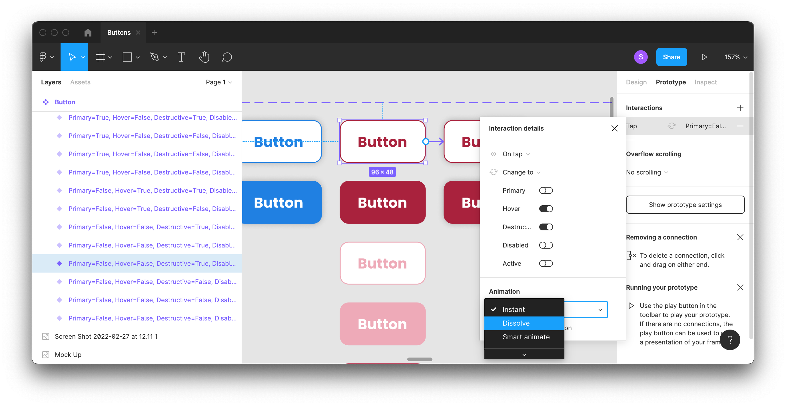

# Interactive Components

With [Variants](../Variants.md), we saw that we can create multiple states for a given component and we can toggle between them while we're designing. But, what about making them interactive in our prototypes?

Interactive Components allow you to set up connections between variants. The basic idea here is we don't want to have to create a new frame for every possible state of our UI.

## Creating an Interactive Component

* Start with a component that has several variants. (Either the [Buttons](Buttons.md) or [Check Boxes and Radio Buttons](Check%20Boxes%20and%20Radio%20Buttons.md) from earlier are good fits for this).
* Click on the **Prototype** tab in the **Right Sidebar**.
* You should see a white dot along the side of the variant.
* With the variant that you want to use as a starting state find the white dot along the side.
* You can also create a change interaction in the opposite direction as well. (For example, let's say that you have check boxes. You might want to wire up both checking and unchecking the checkbox.)

## Exercise

Create an interactive component out of one of the components that we created earlier.

* [Buttons](Buttons.md)
* [Check Boxes and Radio Buttons](Check%20Boxes%20and%20Radio%20Buttons.md)
* [Toggles](Toggles.md)
* [Drop Down Menus](Drop%20Down%20Menus.md)
