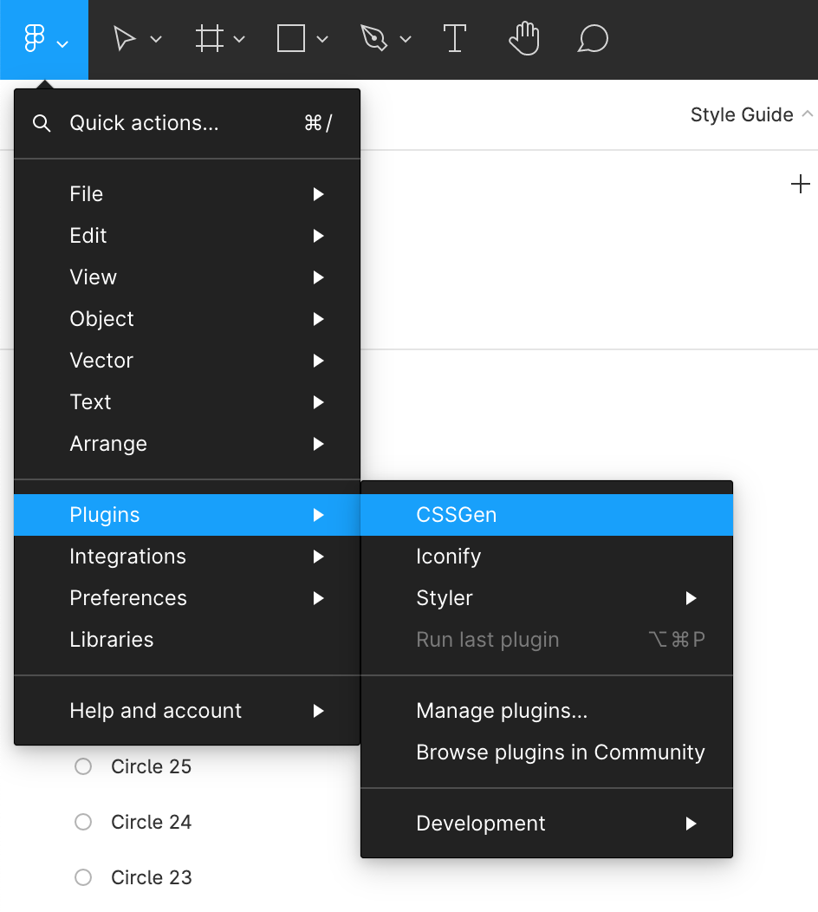
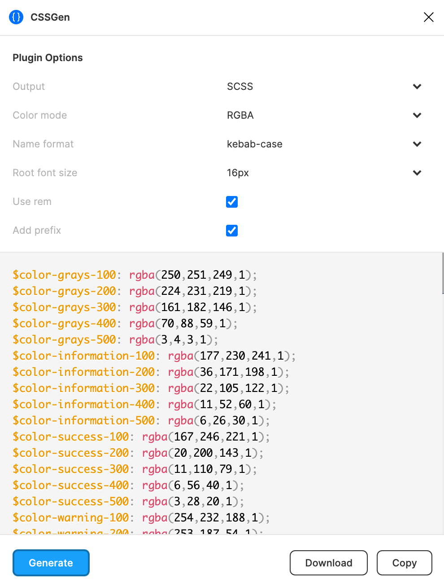

# Exporting Styles Using CSSGen

Once we have a reasonable set of styles set up in Figma, we can use a plugin called [CSSGen](https://www.figma.com/community/plugin/742750636238601912/CSSGen) to create styles that we can use in our codebase.

