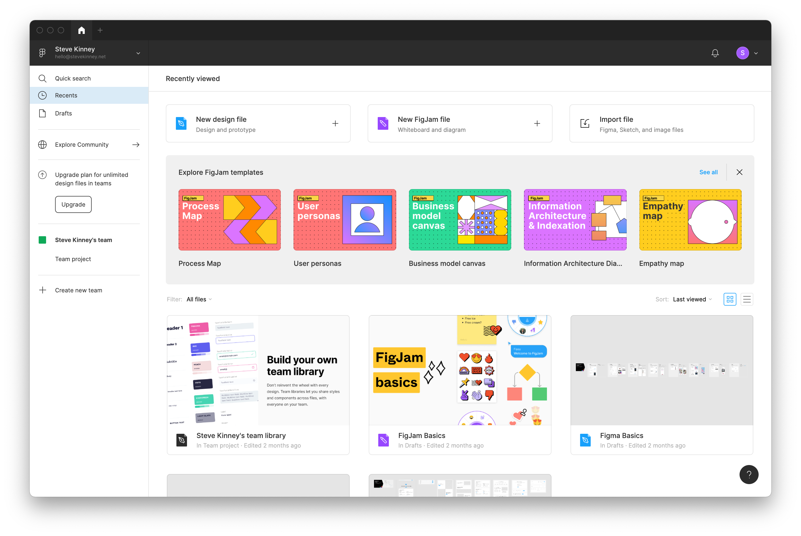
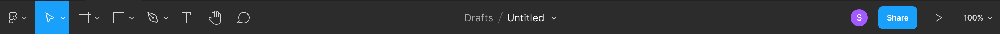

# Getting Comfortable

When you first fire up Figma, you'll be greeted with a window that looks something like this.

Let's start by creating a new design file.

## The Toolbar

You've got that toolbar along the top.

For starters, there is the Figma menu. I guess it's similar to the Apple menu in macOS or the start button in Windows. There are a whole bunch of options that'll we poke at over the course of our time together.

Next up, you have **Move tools**. This menu contains two tools: **Move** and **Scale**.

Inside of **Region tools**, you have the following: **Frame** and **Slice**.

Then there are **Shape tools**. You'll find a bunch of—wait for it—shapes here that you're more than welcome to incorporate into your designs. You can also place an image into your design.

In **Drawing tools**, you have the **Pen** and **Pencil**.

Lastly, there are a bunch of tools that warrant their own prime placement, (Well, either that or they couldn't fit in anywhere else.) You've got the **Text tool**, the **Hand tool**, which you can use to yourself around the page, and **Add comment**.

If you click on the file name, you'll find another menu hiding out. Figma has a form of **version control** that will allow you to do fancy things like create branches. You can also **export**, **publish**, and **move** the file around here.

Finally, at the right end of the toolbar, you have some **collaboration tools**, which will allow you to share your design and even chat about it without the need to hop onto a Zoom call.

You can **present** your **interactive prototype**, deal with missing fonts, and zoom in/out.

## The Left Sidebar

In the left sidebar, you'll see an index of all of your **layers** and **assets**. Layers are basically like the *things* in your design. If you want to think of them as *objects*, that's totally reasonable.

Assets are things like **[Components](Components.md)**. Are reusable "classes" that you can instantiate in your design.

Lastly, you have your pages, which are like pages. You know what pages are right?

## The Right Sidebar

The right sidebar has everything you to tweak all of the different properties of your layers. Don't fret—we'll spend plenty of time exploring this area.
