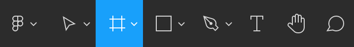
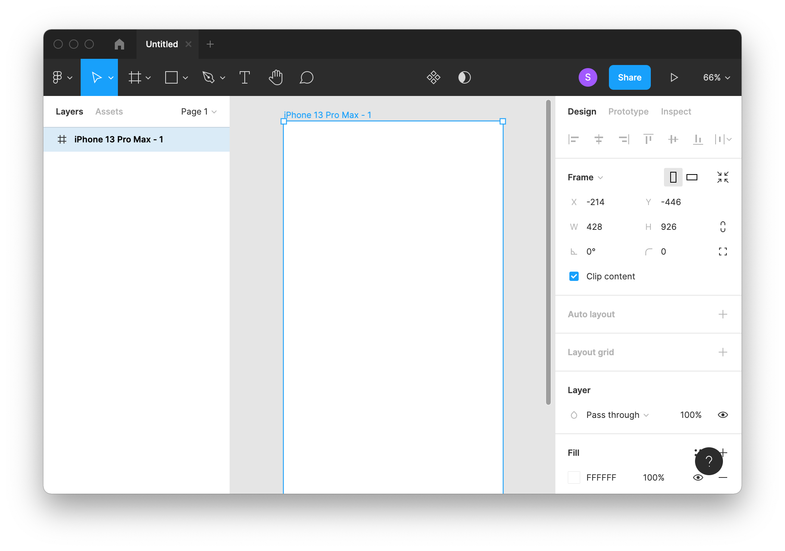
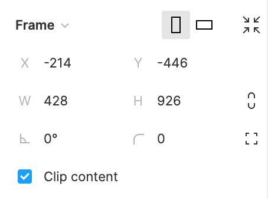
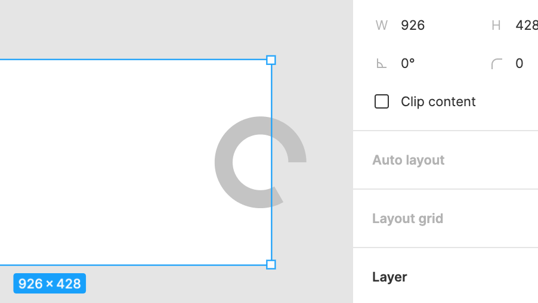
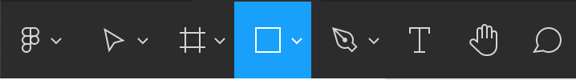
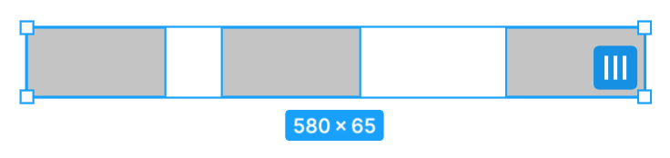
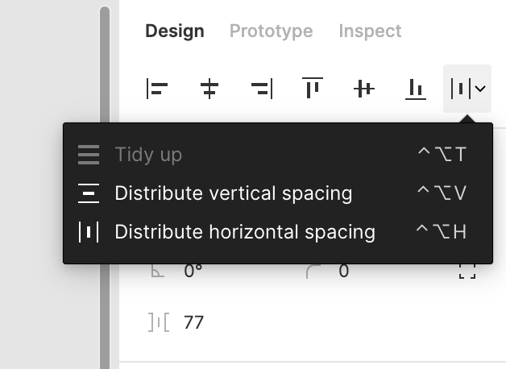

# Getting Started

Now that we've got an empty file, let's maybe put some stuff in it? The first thing we're going to drag in is something called a **[frame](Frames%20and%20Groups.md)**. We'll go a little bit deeper into how frames work in a bit, but let's just start by getting one on the page.

## Creating a Frame

You can select the **Frame tool** or you can just press the `F` key. To create a frame, you have a few options: drag and create a frame in the size of your choosing or just pick one of the presets based on common device viewports that you may or may not find yourself designing for from the **right sidebar**.

I'll start with an *iPhone 13 Pro Max*.

Okay, there are a few quick things to notice here:

* Your new **frame** appears under **Layers** in the left sidebar.
* There are a bunch of settings that you can tweak in the **right sidebar** when the frame is currently selected.

Some tasting notes:

* If you want to change the device that you selected, you can click on the drop down menu attached to **Frame**.
* You can swap between *vertical* and *horizontal* orientation.
* **Clip content** controls whether or not objects that overflow the bounds of the container are displayed or not. If you uncheck that box, you'll see the rest of the object.

## Working with Objects

Let's start by making a quick shape that we can play around with. I'm going to make a rectangle by choosing it form the **Shape tools**.

You can click and drag to make a rectangle of the size and proportions that you desire.

* If you just click, you'll get a 100-by-100 square.
* If you hold `Shift` while dragging, you'll get a proportional shape.
* If you hold `Space` while dragging, you can move the shape around while you're dragging. It's like multi-tasking.

Once you have object, you can do some other fun stuff with it:

* If you hold `Alt` or `Option` while dragging an object, you'll make a copy.
  * If this is *not* what you wanted to do, then let go of `Alt`/`Option` and Figma will just move the object for you.
* You can right-click on the shape and expose a contextual menu with a ton of options that we'll explore in our time together.

## Distributing Objects

You can select multiple objects and distribute by clicking on those three bars in the lower-right.

In the **right sidebar**, you've got some additional tools for aligning and distributing objects.

### Quick Exercise

<iframe style="border: 1px solid rgba(0, 0, 0, 0.1);" width="800" height="450" src="https://www.figma.com/embed?embed_host=share&url=https%3A%2F%2Fwww.figma.com%2Ffile%2FP8P6tYmPrmr0NTmw1T1BWL%2FFrontend-Masters-Playground%3Fnode-id%3D9%253A27" allowfullscreen></iframe>

Head over to [this Figma page](https://www.figma.com/file/P8P6tYmPrmr0NTmw1T1BWL/?node-id=0%3A1) and see if you can use the tools in the sidebar to align the red and blue rectangles as needed.
